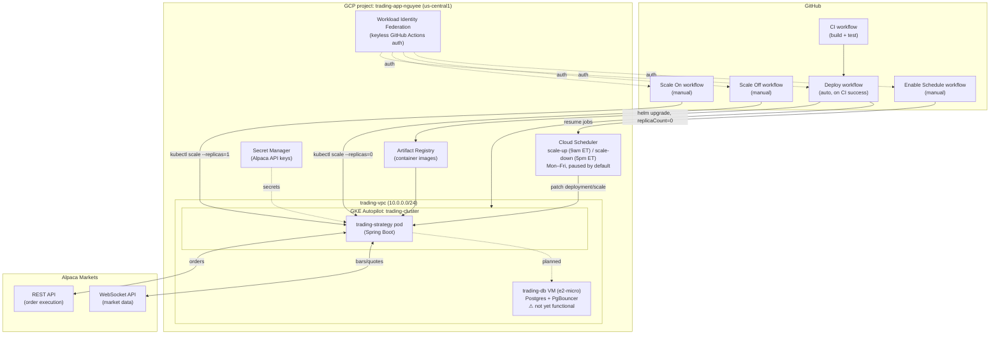

# Trading Application — Design Document

## 1. Background

### Service

An algorithmic trading application that connects to [Alpaca Markets](https://alpaca.markets/)
to execute a moving-average crossover strategy. It ingests real-time market data,
evaluates the strategy on each bar, and submits orders through Alpaca's brokerage
API. The system runs in paper-trading mode during development, with the same
codebase intended to switch to live trading via configuration only.

### Goal

Automate systematic, rules-based order execution on a fixed schedule aligned to
US market hours, while running as cheaply as possible on GCP — the compute
footprint scales to zero outside the Mon–Fri 9am–5pm ET trading window instead
of running (and billing) 24/7.

### Current status

- **Done:** domain model, port interfaces, Alpaca REST order gateway, Alpaca
  WebSocket market-data gateway, GCP infrastructure (VPC, GKE Autopilot,
  Artifact Registry, Secret Manager, Workload Identity Federation), CI/CD
  pipeline (build → push → Helm deploy), and on/off/schedule control via
  GitHub Actions + Cloud Scheduler.
- **Not yet built:** the moving-average crossover strategy logic itself, JPA
  persistence, and the `trading-consumers` / `trading-observability` modules.
- **Known gap:** the Postgres VM (`trading-db`) is provisioned but has no
  internet egress path, so Postgres/PgBouncer have never actually installed —
  fix deferred until the persistence layer is built.

## 2. Architecture

### Current architecture

### Component breakdown

| Module | Role | Deployed? |
|---|---|---|
| `trading-core` | Domain records (`Bar`, `Order`, `Symbol`, …) and port interfaces (`OrderGateway`, `MarketDataGateway`, `SecretStore`) — no framework dependencies | No (library) |
| `trading-market-data` | Alpaca WebSocket gateway implementing `MarketDataGateway` | No (library, embedded in `trading-strategy`) |
| `trading-strategy` | Alpaca REST order gateway, secret store adapters, Spring Boot entry point | **Yes** — the only Helm-deployed service today |
| `trading-consumers` *(planned)* | Stateless event consumers | Not yet built |
| `trading-observability` *(planned)* | OTel config + Micrometer metrics | Not yet built |
| `trading-infra` | Terraform (GCP) + Helm chart + GitHub Actions workflows | N/A (infra-as-code) |

Only one Kubernetes Deployment exists today (`trading-strategy`), which embeds
both the order-execution and market-data adapters in a single pod. The
port/adapter pattern means the strategy engine (once written) depends only on
`trading-core`'s interfaces, not on Alpaca or Spring directly — swapping
brokers or adding a second venue means writing a new adapter, not touching
the strategy logic.

The **off-by-default + scheduler** design (covered in detail earlier this
session) means the pod normally runs only Mon–Fri 9am–5pm ET; a code deploy
always resets it to 0 replicas, and three manual GitHub Actions workflows
give explicit on/off/schedule control independent of deploys.

### Target architecture

> **Status: not yet built.** This is the intended end-state once the
> strategy engine and event-driven consumers exist — described here for
> planning purposes, not as a reflection of what's deployed today.

**What changes vs. the current architecture:**

- The single `trading-strategy` pod splits into a **Strategy engine pod**
  (MA crossover + order submission) and a dedicated **Market data gateway
  pod** that holds Alpaca's one-per-account market-data WebSocket connection
  and fans it out over Pub/Sub — avoiding a connection-limit problem if a
  second strategy or consumer ever needs the same feed.
- **Pub/Sub** (`order events`, `market data` topics) replaces direct
  in-process calls, decoupling producers from consumers and buffering events
  so a scaled-to-zero consumer doesn't lose fills/bars while it's off.
- Five single-purpose **consumer pods** (Order state, Portfolio, Risk,
  Notify, Bar store) replace the current all-in-one pod, each independently
  deployable and scale-to-zero via Cloud Scheduler (no KEDA — kept out of
  this revision since it isn't installed anywhere in this repo today).
- A separate **REST API pod** isolates client-facing reads from the trading
  write path.
- Storage stays on the same free-tier `PostgreSQL on e2-micro` VM (now the
  single source of truth for orders/fills/positions/bars — no Redis/
  Memorystore, which was dropped from this revision specifically to avoid
  its always-on, non-free-tier cost) plus **Cloud Storage** for FIX-log/
  backup archival.

**Tradeoffs to weigh before building this:**

- Meaningfully more operational surface (8 pods + 2 Pub/Sub topics + mTLS)
  than the current single pod — makes the still-unbuilt
  `trading-observability` module load-bearing rather than optional.
- Splitting Order state / Portfolio / Risk into separate consumers off the
  same topic introduces eventual consistency between them — for
  risk/exposure correctness this needs deliberate idempotency/ordering
  design, not just "add Pub/Sub."
- Not free: Pub/Sub plus three always-on pods (Strategy engine, Market data
  gateway, REST API) move this off the ~$0 footprint the current
  architecture and the rest of this project's infra (always-free e2-micro,
  scale-to-zero GKE) have otherwise stuck to. Estimated ~$11–13/mo.
- This event-driven shape is also the natural precursor to the FIX API
  future-consideration noted below — if that migration happens, it would
  build on this architecture rather than the current single-pod one.

## 3. Tech Stack

| Concern | Choice |
|---|---|
| Language / runtime | Java 21 (Eclipse Temurin) |
| Framework | Spring Boot 3.3.5, Maven multi-module |
| Cloud provider | GCP — GKE Autopilot, Compute Engine (e2-micro, always-free tier), Cloud Scheduler, Secret Manager, Artifact Registry |
| CI/CD | GitHub Actions, authenticated to GCP via Workload Identity Federation (no long-lived service account keys) |
| Deployment | Helm chart applied via `helm upgrade --install` |
| Broker / market data | Alpaca Markets — **REST API** for order execution, **WebSocket API** for market data |
| Persistence | Planned: PostgreSQL + PgBouncer on a standalone Compute Engine VM (not Cloud SQL, to stay in the always-free tier) |

### Alpaca API choice: REST, not FIX

Alpaca exposes both a REST/WebSocket API and a FIX API. This project uses
**REST for orders and WebSocket for market data**, not FIX:

- The strategy (moving-average crossover, evaluated per bar) is not
  latency-sensitive — nothing here approaches the tick-level timing FIX is
  built for.
- REST + WebSocket integrates directly with Spring Boot's standard HTTP/WS
  clients; no FIX engine, session management, or sequence-number recovery
  logic is needed.
- Lower operational overhead: no persistent FIX session to keep alive,
  re-establish after disconnects, or monitor separately from the app itself.

> **Future consideration:** if the architecture evolves toward a pure
> async, event-driven model (e.g. reacting to fills and market data as a
> unified event stream rather than REST request/response + a separate WS
> feed), Alpaca's FIX API would be a better fit — FIX is inherently a
> persistent, message-oriented protocol, which maps more naturally onto an
> event-driven design than polling/request-response REST calls do. Not
> pursued now; noted here for when/if that architectural shift happens.
